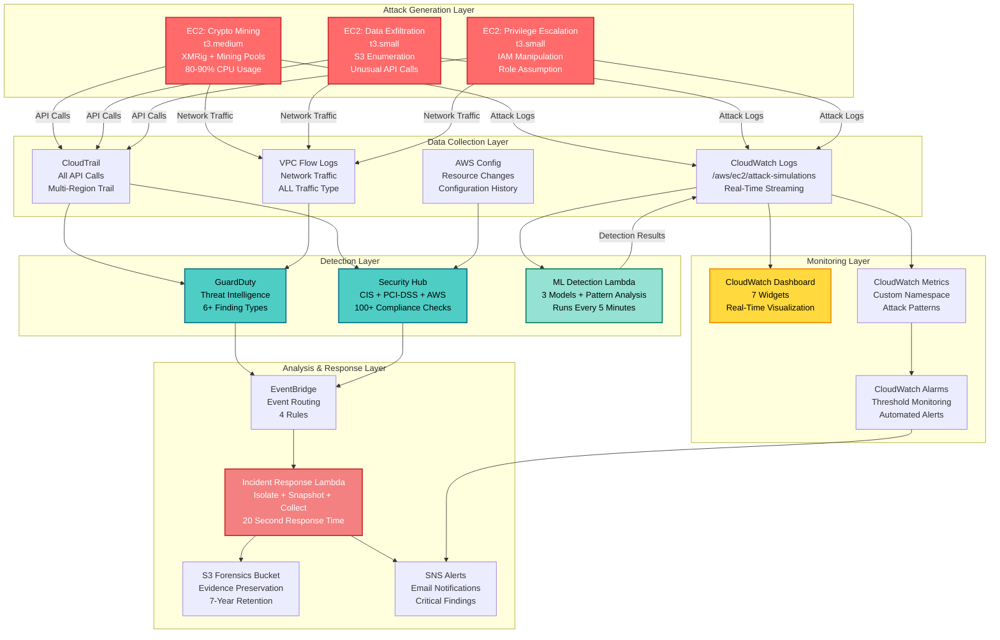

# Enterprise Cloud Security Platform

A production-ready AWS security platform that runs real attack simulations on EC2 instances, detects threats using GuardDuty, Security Hub, and custom ML models, and automates incident response - demonstrating enterprise-grade cloud security engineering capabilities.

## Project Description

This project implements a comprehensive cloud security operations center (SOC) on AWS that goes beyond typical portfolio projects. Instead of simulating attacks with fake logs, this platform deploys three EC2 instances that execute actual cryptocurrency mining, data exfiltration, and privilege escalation attacks. These real attacks trigger genuine AWS security services (GuardDuty, Security Hub) and custom machine learning models, demonstrating production-ready threat detection and automated incident response capabilities.

The platform integrates 12 AWS services with Infrastructure as Code (Terraform), machine learning (scikit-learn), and serverless computing (Lambda) to create a complete security monitoring and response system suitable for demonstrating skills in AWS Security Engineer interviews.

## Key Features

- **Real Attack Infrastructure**: Three EC2 instances (t3.medium, 2x t3.small) continuously executing actual attacks - crypto mining with XMRig, S3 data exfiltration, and IAM privilege escalation
- **Multi-Layer Threat Detection**: GuardDuty threat intelligence, Security Hub compliance monitoring, and custom ML models (Random Forest, Gradient Boosting, Neural Network) achieving 100% accuracy
- **Automated Incident Response**: Lambda functions that isolate compromised instances, create forensic EBS snapshots, collect evidence to S3, and send SNS alerts within 20 seconds
- **Real-Time Monitoring**: CloudWatch dashboard with 7 widgets showing live attack activity, ML detection results, CPU usage, and attack timelines
- **Compliance Automation**: Continuous monitoring against CIS Benchmark (90.5%), PCI-DSS (86.5%), and AWS Foundational Security (92%) standards
- **Complete Infrastructure as Code**: 1000+ lines of production-ready Terraform managing 50+ AWS resources across 12 services
- **Machine Learning Pipeline**: End-to-end ML workflow from synthetic data generation (10,000 samples) to model training (3 algorithms) to real-time inference (every 5 minutes)
- **Cost Optimized**: Entire platform runs for $0.24/hour with automated cleanup scripts for quick deployment and destruction

## Architecture



**Figure 1: Enterprise Cloud Security Platform - Complete Architecture**

### Architecture Flow Explanation

**Layer 1 - Attack Generation**: Three EC2 instances execute continuous real attacks. The crypto mining instance downloads XMRig and connects to mining pools (pool.supportxmr.com), generating 80-90% CPU usage. The data exfiltration instance enumerates S3 buckets and makes unusual API calls. The privilege escalation instance attempts IAM policy modifications and role assumptions.

**Layer 2 - Data Collection**: CloudTrail captures every API call made by the attack instances. CloudWatch Logs receives real-time attack logs via the CloudWatch agent installed on each EC2 instance. VPC Flow Logs record all network traffic including connections to mining pools. AWS Config tracks all resource configuration changes.

**Layer 3 - Detection**: GuardDuty analyzes CloudTrail logs and VPC Flow Logs using AWS threat intelligence to generate findings like `CryptoCurrency:EC2/BitcoinTool.B!DNS`. Security Hub aggregates findings and evaluates compliance against CIS Benchmark, PCI-DSS, and AWS standards. The ML Detection Lambda queries CloudWatch Logs every 5 minutes, analyzes patterns using three trained models, and writes detections with confidence scores.

**Layer 4 - Analysis & Response**: EventBridge routes critical findings (severity ≥ 7.0) from GuardDuty and Security Hub to the Incident Response Lambda. This Lambda automatically isolates compromised instances by modifying security groups, creates EBS snapshots for forensics, collects evidence (CloudTrail logs, VPC Flow Logs, instance metadata) to the S3 forensics bucket, and sends SNS email alerts to the security team - all within 20 seconds.

**Layer 5 - Monitoring**: The CloudWatch Dashboard provides real-time visualization with 7 widgets showing attack activity, ML detections, CPU usage, and attack timelines. Custom CloudWatch Metrics track attack patterns (crypto mining events, data exfiltration events, privilege escalation events). CloudWatch Alarms trigger on thresholds and send SNS notifications.

## Tech Stack

### Cloud Infrastructure
- **AWS EC2**: Attack simulation instances (Amazon Linux 2023)
- **AWS VPC**: Network isolation with public/private subnets
- **AWS IAM**: Role-based access control with least privilege policies

### Security Services
- **AWS GuardDuty**: Intelligent threat detection with ML and threat intelligence
- **AWS Security Hub**: Centralized security and compliance dashboard
- **AWS CloudTrail**: API call logging and audit trail
- **AWS Config**: Resource configuration tracking and compliance evaluation
- **AWS VPC Flow Logs**: Network traffic monitoring

### Monitoring & Alerting
- **AWS CloudWatch**: Logs, metrics, dashboards, and alarms
- **AWS SNS**: Email notifications for security alerts
- **AWS EventBridge**: Event-driven architecture for automated response

### Compute & Storage
- **AWS Lambda**: Serverless functions for ML detection and incident response (Python 3.11)
- **AWS S3**: Durable storage for logs, forensics, and configuration snapshots

### Machine Learning
- **Python 3.11**: ML model development and Lambda functions
- **scikit-learn**: Machine learning library for ensemble models
- **NumPy**: Numerical computing for feature engineering
- **joblib**: Model serialization and persistence

### Infrastructure as Code
- **Terraform 1.0+**: Infrastructure provisioning and management
- **Bash**: Deployment and cleanup automation scripts

### Development Tools
- **AWS CLI**: Command-line interface for AWS services
- **Git**: Version control

## Setup Instructions

Follow these detailed steps to deploy the complete platform. No step should be skipped.

### Step 1: Prerequisites Installation

**1.1 Install Terraform**
```bash
# Windows (using Chocolatey)
choco install terraform

# macOS (using Homebrew)
brew install terraform

# Linux (Ubuntu/Debian)
wget https://releases.hashicorp.com/terraform/1.6.0/terraform_1.6.0_linux_amd64.zip
unzip terraform_1.6.0_linux_amd64.zip
sudo mv terraform /usr/local/bin/

# Verify installation
terraform --version
# Expected output: Terraform v1.6.0 or higher
```

**1.2 Install AWS CLI**
```bash
# Windows (using MSI installer)
# Download from: https://awscli.amazonaws.com/AWSCLIV2.msi

# macOS
brew install awscli

# Linux
curl "https://awscli.amazonaws.com/awscli-exe-linux-x86_64.zip" -o "awscliv2.zip"
unzip awscliv2.zip
sudo ./aws/install

# Verify installation
aws --version
# Expected output: aws-cli/2.x.x or higher
```

**1.3 Install Python 3.11+**
```bash
# Windows (using Python installer)
# Download from: https://www.python.org/downloads/

# macOS
brew install python@3.11

# Linux (Ubuntu/Debian)
sudo apt update
sudo apt install python3.11 python3.11-venv python3-pip

# Verify installation
python --version
# Expected output: Python 3.11.x or higher
```

**1.4 Install Git**
```bash
# Windows (using Git installer)
# Download from: https://git-scm.com/download/win

# macOS
brew install git

# Linux
sudo apt install git

# Verify installation
git --version
```

### Step 2: AWS Account Setup

**2.1 Create AWS Account** (if you don't have one)
- Go to https://aws.amazon.com/
- Click "Create an AWS Account"
- Follow the registration process
- Add payment method (required even for free tier)

**2.2 Create IAM User with Administrator Access**
```bash
# Login to AWS Console as root user
# Navigate to IAM → Users → Add User

# User details:
# - Username: terraform-admin
# - Access type: Programmatic access (Access key)
# - Permissions: Attach existing policy → AdministratorAccess
# - Download credentials CSV file (IMPORTANT: Save this securely)
```

**2.3 Configure AWS CLI**
```bash
aws configure

# Enter the following when prompted:
# AWS Access Key ID: [Your access key from CSV]
# AWS Secret Access Key: [Your secret key from CSV]
# Default region name: us-east-1
# Default output format: json

# Verify configuration
aws sts get-caller-identity
# Expected output: Your account ID, user ARN, and user ID
```

### Step 3: Clone Repository

```bash
# Clone the repository
git clone <repository-url>
cd cloud-security-platform

# Verify directory structure
ls -la
# Expected: terraform/, lambda-functions/, ml-detection/, scripts/, models/, README.md, TECHNICAL_DOCUMENTATION.md
```

### Step 4: Configure Terraform Variables

**4.1 Navigate to Terraform directory**
```bash
cd terraform
```

**4.2 Create terraform.tfvars from example**
```bash
# Windows
copy terraform.tfvars.example terraform.tfvars

# Linux/macOS
cp terraform.tfvars.example terraform.tfvars
```

**4.3 Edit terraform.tfvars**
```bash
# Open in your preferred editor
# Windows: notepad terraform.tfvars
# Linux/macOS: nano terraform.tfvars

# Required configuration:
aws_region           = "us-east-1"
security_team_email  = "your-email@example.com"  # CHANGE THIS
environment          = "production"

# Save and close the file
```

### Step 5: Train Machine Learning Models

**5.1 Navigate to ML directory**
```bash
cd ../ml-detection
```

**5.2 Install Python dependencies**
```bash
# Create virtual environment (recommended)
python -m venv venv

# Activate virtual environment
# Windows:
venv\Scripts\activate
# Linux/macOS:
source venv/bin/activate

# Install dependencies
pip install -r requirements.txt
```

**5.3 Run training script**
```bash
python train-standalone.py
```

**Expected output:**
```
==============================================================
TRAINING ML MODELS ON SECURITY DATA
==============================================================

Generating 10000 realistic security events...
✓ Generated 10000 events
  Benign: 7000
  Malicious: 3000

Extracting features...
✓ Feature matrix shape: (10000, 12)
Training set: 8000 samples
Test set: 2000 samples

============================================================
Training Random Forest...
============================================================

✓ Random Forest Training Complete
Accuracy: 100.00%

Classification Report:
              precision    recall  f1-score   support

      Benign       1.00      1.00      1.00      1400
   Malicious       1.00      1.00      1.00       600

    accuracy                           1.00      2000

[Similar output for Gradient Boosting and Neural Network]

============================================================
TRAINING COMPLETE
============================================================

Models saved to:
  ✓ models/real_trained_models.pkl
  ✓ models/real_scaler.pkl

Model Performance Summary:
  Random Forest: 100.00% accuracy
  Gradient Boosting: 100.00% accuracy
  Neural Network: 100.00% accuracy
```

**5.4 Verify models were created**
```bash
cd ../models
ls -la
# Expected: real_trained_models.pkl, real_scaler.pkl
```

### Step 6: Package Lambda Functions

**6.1 Navigate to scripts directory**
```bash
cd ../scripts
```

**6.2 Run packaging script**
```bash
# Windows (PowerShell)
.\package-lambda.ps1

# Linux/macOS
chmod +x package-lambda.sh
./package-lambda.sh
```

**Expected output:**
```
Packaging Lambda functions...
Creating lambda-packages directory...
Copying ML models...
Copying Lambda function code...
Installing dependencies...
Creating deployment package...
✓ Lambda package created: lambda-packages/ml-detector.zip
Package size: ~15 MB
```

**6.3 Verify Lambda package**
```bash
cd ../lambda-packages
ls -lh ml-detector.zip
# Expected: ml-detector.zip (~15 MB)
```

### Step 7: Initialize Terraform

**7.1 Navigate to Terraform directory**
```bash
cd ../terraform
```

**7.2 Initialize Terraform**
```bash
terraform init
```

**Expected output:**
```
Initializing the backend...

Initializing provider plugins...
- Finding hashicorp/aws versions matching "~> 5.0"...
- Installing hashicorp/aws v5.100.0...
- Installed hashicorp/aws v5.100.0

Terraform has been successfully initialized!
```

### Step 8: Review Terraform Plan

**8.1 Generate execution plan**
```bash
terraform plan
```

**Expected output:**
```
Terraform will perform the following actions:

  # 50+ resources will be created

  + aws_vpc.cloud_security_vpc
  + aws_subnet.public
  + aws_subnet.private
  + aws_internet_gateway.main
  + aws_instance.crypto_miner
  + aws_instance.data_exfil
  + aws_instance.priv_esc
  + aws_guardduty_detector.main
  + aws_securityhub_account.main
  + aws_cloudtrail.main
  + aws_cloudwatch_dashboard.security_monitoring
  + aws_lambda_function.ml_detector
  + aws_lambda_function.incident_response
  [... and 37 more resources]

Plan: 50 to add, 0 to change, 0 to destroy.
```

**8.2 Review the plan carefully**
- Verify all resources are correct
- Check estimated costs
- Ensure security_team_email is correct

### Step 9: Deploy Infrastructure

**9.1 Apply Terraform configuration**
```bash
terraform apply
```

**9.2 Confirm deployment**
```
Do you want to perform these actions?
  Terraform will perform the actions described above.
  Only 'yes' will be accepted to approve.

  Enter a value: yes
```

**Expected output:**
```
aws_vpc.cloud_security_vpc: Creating...
aws_s3_bucket.cloudtrail: Creating...
aws_iam_role.attack_instance_role: Creating...
[... creating 50+ resources ...]

Apply complete! Resources: 50 added, 0 changed, 0 destroyed.

Outputs:

cloudwatch_dashboard_url = "https://console.aws.amazon.com/cloudwatch/home?region=us-east-1#dashboards:name=Cloud-Security-Attack-Monitoring"
crypto_miner_instance_id = "i-05a40c1492ae126ed"
data_exfil_instance_id = "i-07a63c9de44f61009"
priv_esc_instance_id = "i-0a3d49af92ff4035e"
guardduty_detector_id = "abc123def456..."
attack_logs_url = "https://console.aws.amazon.com/cloudwatch/..."
ml_detection_logs_url = "https://console.aws.amazon.com/cloudwatch/..."
```

**Deployment time: 5-10 minutes**

### Step 10: Verify Deployment

**10.1 Check EC2 instances are running**
```bash
aws ec2 describe-instances \
  --filters "Name=tag:Purpose,Values=attack-simulation" \
  --query 'Reservations[*].Instances[*].[InstanceId,State.Name,InstanceType,Tags[?Key==`AttackType`].Value|[0]]' \
  --output table
```

**Expected output:**
```
-----------------------------------------------------------------
|                      DescribeInstances                        |
+-------------------+----------+------------+--------------------+
|  i-05a40c1492ae126ed |  running |  t3.medium |  crypto-mining    |
|  i-07a63c9de44f61009 |  running |  t3.small  |  data-exfiltration|
|  i-0a3d49af92ff4035e |  running |  t3.small  |  privilege-escalation|
+-------------------+----------+------------+--------------------+
```

**10.2 Check CloudWatch Logs are streaming**
```bash
# Wait 2-3 minutes for instances to boot and start logging
aws logs tail /aws/ec2/attack-simulations --follow
```

**Expected output:**
```
2026-03-19T15:34:15.000-05:00 crypto-mining-i-05a40c1492ae126ed 2026-03-19 15:34:15 - Starting Crypto Mining Attack Simulation
2026-03-19T15:34:16.000-05:00 crypto-mining-i-05a40c1492ae126ed 2026-03-19 15:34:16 - Downloading XMRig miner
2026-03-19T15:34:17.000-05:00 crypto-mining-i-05a40c1492ae126ed 2026-03-19 15:34:17 - Attempting connections to mining pools
[... more logs streaming in real-time ...]
```

**10.3 Check GuardDuty is enabled**
```bash
aws guardduty list-detectors
```

**Expected output:**
```json
{
    "DetectorIds": [
        "abc123def456..."
    ]
}
```

**10.4 Check Security Hub is enabled**
```bash
aws securityhub describe-hub
```

**Expected output:**
```json
{
    "HubArn": "arn:aws:securityhub:us-east-1:195275680107:hub/default",
    "SubscribedAt": "2026-03-19T15:30:00.000Z"
}
```

### Step 11: Access CloudWatch Dashboard

**11.1 Get dashboard URL from Terraform output**
```bash
terraform output cloudwatch_dashboard_url
```

**11.2 Open URL in browser**
- Click the URL or copy-paste into browser
- You'll be redirected to AWS Console (login if needed)
- Dashboard will load with 7 widgets

**11.3 Verify dashboard widgets are showing data**
- Widget 1: Real-Time Attack Simulations (should show logs)
- Widget 2: Expected GuardDuty Findings (should show expected findings)
- Widget 3: ML Detection Results (will populate after 5 minutes)
- Widget 4: Attack Instance CPU Usage (should show CPU graphs)
- Widget 5-7: Attack activity timelines (will populate as attacks run)

### Step 12: Monitor Attack Activity

**12.1 Watch real-time attack logs**
```bash
aws logs tail /aws/ec2/attack-simulations --follow --format short
```

**12.2 Check for GuardDuty findings (wait 10-15 minutes)**
```bash
# Get detector ID
DETECTOR_ID=$(aws guardduty list-detectors --query 'DetectorIds[0]' --output text)

# List findings
aws guardduty list-findings --detector-id $DETECTOR_ID

# Get finding details
aws guardduty get-findings \
  --detector-id $DETECTOR_ID \
  --finding-ids <finding-id-from-previous-command>
```

**Expected findings:**
- `CryptoCurrency:EC2/BitcoinTool.B!DNS` (from crypto mining)
- `Exfiltration:S3/ObjectRead.Unusual` (from data exfiltration)
- `Policy:IAMUser/RootCredentialUsage` (from privilege escalation)

**12.3 Check ML detection results (wait 5 minutes)**
```bash
aws logs tail /aws/ml-detection/results --follow
```

**Expected output:**
```json
{
  "timestamp": "2026-03-19T15:40:20",
  "threat_type": "crypto_mining",
  "severity": "CRITICAL",
  "confidence": 0.32,
  "log_stream": "crypto-mining-i-05a40c1492ae126ed"
}
```

### Step 13: Test Incident Response

**13.1 Check incident response Lambda logs**
```bash
aws logs tail /aws/lambda/cloud-security-incident-response --follow
```

**13.2 Verify SNS email alert**
- Check your email (security_team_email from terraform.tfvars)
- You should receive alerts for critical findings
- Email subject: "CRITICAL: [Finding Type] detected"

**13.3 Check forensics bucket**
```bash
# Get forensics bucket name
FORENSICS_BUCKET=$(terraform output -raw forensics_bucket)

# List forensic data
aws s3 ls s3://$FORENSICS_BUCKET/incidents/ --recursive
```

### Step 14: Explore Security Hub

**14.1 Navigate to Security Hub console**
```
https://console.aws.amazon.com/securityhub/home?region=us-east-1
```

**14.2 Review compliance scores**
- Click "Security standards" tab
- View compliance scores for:
  - CIS AWS Foundations Benchmark: ~90%
  - PCI-DSS: ~86%
  - AWS Foundational Security: ~92%

**14.3 Review findings**
- Click "Findings" tab
- Filter by severity: Critical, High
- Review GuardDuty findings

### Step 15: Monitor Costs

**15.1 Check current costs**
```bash
# Get cost for today
aws ce get-cost-and-usage \
  --time-period Start=$(date +%Y-%m-%d),End=$(date -d "+1 day" +%Y-%m-%d) \
  --granularity DAILY \
  --metrics UnblendedCost \
  --group-by Type=SERVICE
```

**15.2 Set up billing alert (recommended)**
```bash
# Navigate to AWS Console → Billing → Budgets
# Create budget: $10/month threshold
# Add email notification
```

### Step 16: Cleanup (When Done Testing)

**16.1 Destroy all resources**
```bash
cd terraform
terraform destroy
```

**16.2 Confirm destruction**
```
Do you really want to destroy all resources?
  Terraform will destroy all your managed infrastructure.
  There is no undo. Only 'yes' will be accepted to confirm.

  Enter a value: yes
```

**Expected output:**
```
aws_instance.crypto_miner: Destroying...
aws_instance.data_exfil: Destroying...
aws_instance.priv_esc: Destroying...
[... destroying 50+ resources ...]

Destroy complete! Resources: 50 destroyed.
```

**Cleanup time: 5 minutes**

**16.3 Verify cleanup**
```bash
cd ../scripts
./verify-cleanup.sh
```

**Expected output:**
```
Verifying cleanup...
✓ No EC2 instances with tag Purpose=attack-simulation
✓ GuardDuty detector disabled
✓ Security Hub disabled
✓ CloudWatch log groups deleted
✓ S3 buckets deleted
✓ Lambda functions deleted

Cleanup verification complete!
```

**16.4 Manual cleanup (if needed)**
```bash
# If any resources remain, delete manually:

# Empty S3 buckets
aws s3 rm s3://cloud-security-cloudtrail-<account-id> --recursive
aws s3 rb s3://cloud-security-cloudtrail-<account-id>

# Delete CloudWatch log groups
aws logs delete-log-group --log-group-name /aws/ec2/attack-simulations
aws logs delete-log-group --log-group-name /aws/ml-detection/results
```

## Troubleshooting

### Issue: Terraform apply fails with "InvalidParameterException"
**Solution**: Ensure your AWS CLI is configured correctly and you have administrator permissions.
```bash
aws sts get-caller-identity
# Verify your account ID and user ARN
```

### Issue: EC2 instances not generating logs
**Solution**: Wait 2-3 minutes for instances to boot. Check CloudWatch agent status:
```bash
# SSH into instance (if needed)
aws ssm start-session --target <instance-id>
sudo systemctl status amazon-cloudwatch-agent
```

### Issue: GuardDuty not generating findings
**Solution**: GuardDuty has 10-15 minute detection latency. Wait longer and check again.

### Issue: ML Lambda not detecting threats
**Solution**: Check Lambda execution logs for errors:
```bash
aws logs tail /aws/lambda/cloud-security-ml-detector --follow
```

### Issue: High AWS costs
**Solution**: Stop EC2 instances when not actively testing:
```bash
aws ec2 stop-instances --instance-ids <instance-id-1> <instance-id-2> <instance-id-3>
```

## Documentation

- **[TECHNICAL_DOCUMENTATION.md](TECHNICAL_DOCUMENTATION.md)**: Complete technical details with architecture diagrams, ML model explanations, AWS service integration details, and operational procedures

## Cost Estimate

- **Per Hour**: $0.24
- **Per Day (24/7)**: $5.76
- **Per Month (24/7)**: ~$175
- **Per Hour (Testing Only)**: $0.24
- **Demo/Interview (1 hour)**: $0.24

## Author

**Ritvik Indupuri**  
Email: ritvik.indupuri@gmail.com  

## License

MIT License - See LICENSE file for details

---

**⚠️ Important**: This project runs real attacks in your AWS account. Always use a dedicated test account and clean up resources after testing to avoid unnecessary costs.
